# Benchmark results

## Properties

| Property        | mCPU | Memory (Mb) |
|-----------------|------|-------------|
| Quarkus JVM     | 1000 | 1000        |
| Quarkus GraalVM | 1000 | 1000        |
| Golang Gin      | 1000 | 1000        |

## Benchmark Configuration

### Command

```bash
./benchmark-runner \
  -url={url} \
  -type=mixed-operations \
  -rps=500 \
  -duration=5m \
  -concurrency=500
```

### Parameters

- **RPS (Requests Per Second)**: 500
- **Duration**: 5 minutes

### Test Description

The benchmark uses **mixed-operations** mode, which executes a **full CRUD lifecycle** for each iteration:

1. **POST** `/api/products` - Create a new product and capture its ID
2. **GET** `/api/products/{id}` - Get the created product by ID
3. **PUT** `/api/products/{id}` - Update the product
4. **DELETE** `/api/products/{id}` - Delete the product

Each iteration represents a complete product lifecycle from creation to deletion. The product ID from step 1 is used in subsequent operations (steps 2-4), making the test more realistic.

**RPS Calculation:** The specified RPS (500) represents the total number of **HTTP requests per second**. Since each CRUD cycle consists of 4 HTTP requests (POST + GET + PUT + DELETE), the tool automatically divides the RPS by 4 to determine the cycle rate:
- RPS: 500 HTTP requests/second
- CRUD cycles: 500 / 4 = 125 cycles/second
- Each cycle: 4 HTTP requests

The benchmark tool generates cycles at a constant rate using 500 concurrent workers to simulate realistic load patterns. Latency measurements represent the total time for the complete CRUD cycle.

## IDLE Running

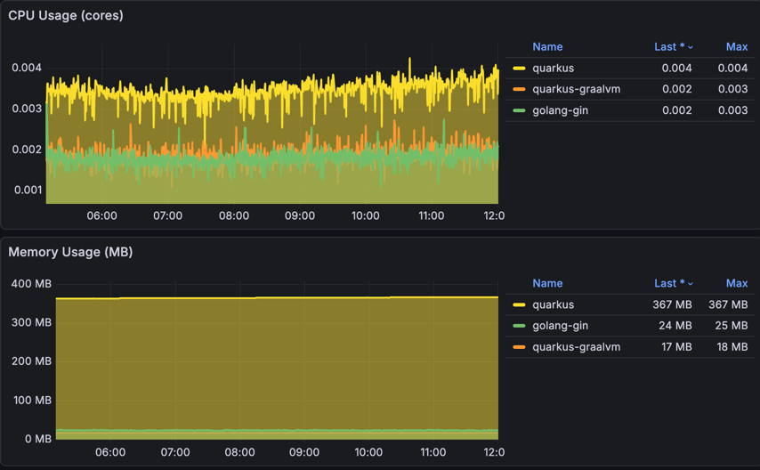

## Quarkus JVM

### First run after deploy

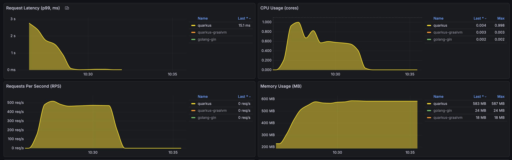

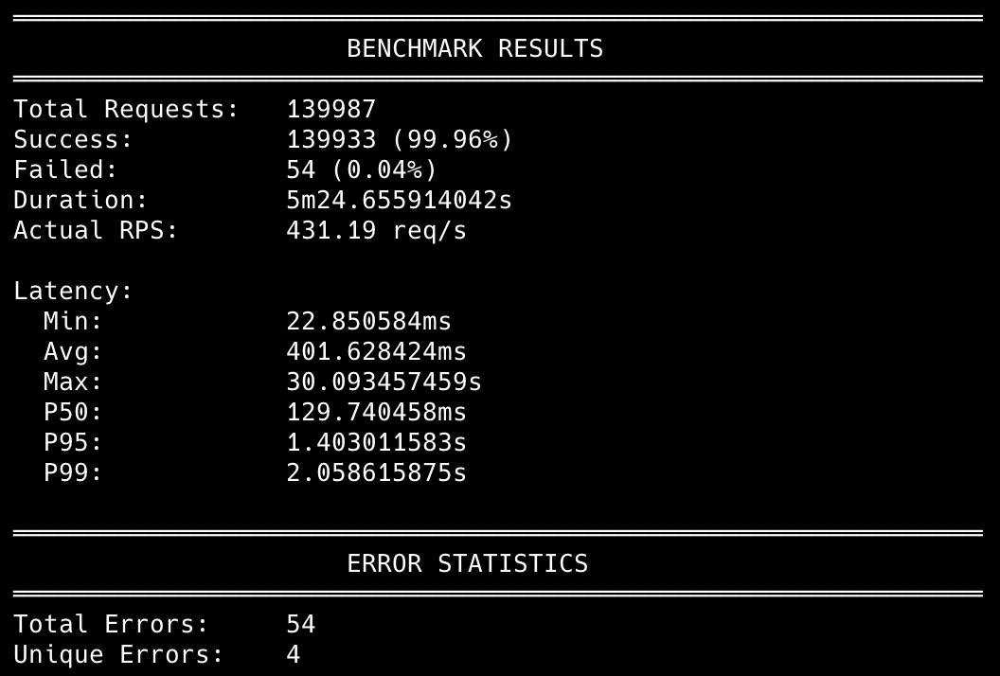

### Second run

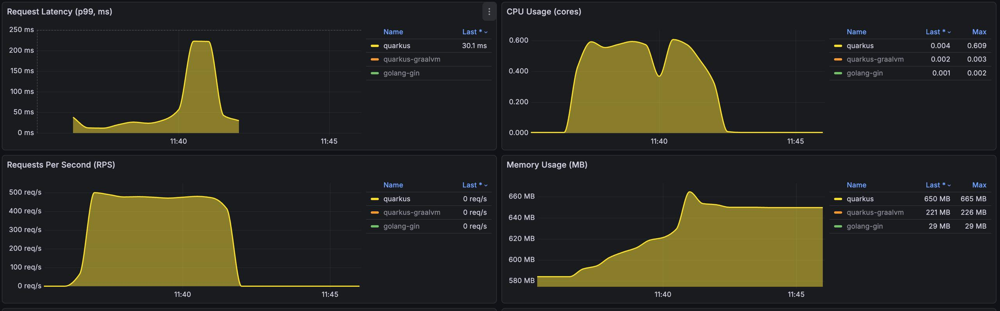

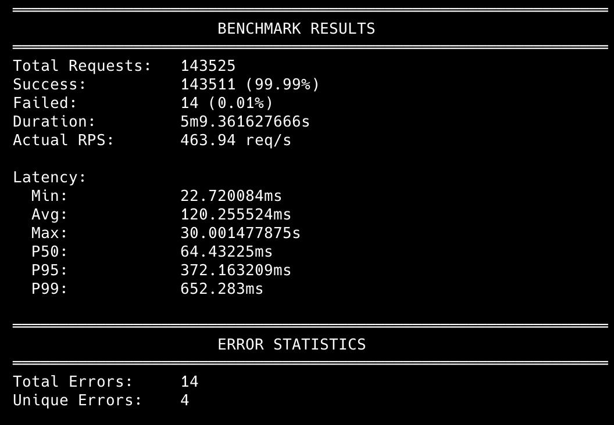


## Quarkus GraalVM

### First run after deploy

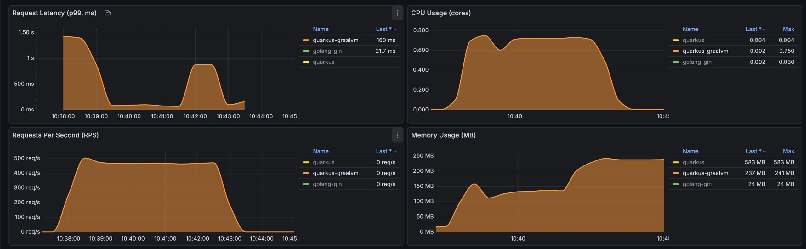


### Second run

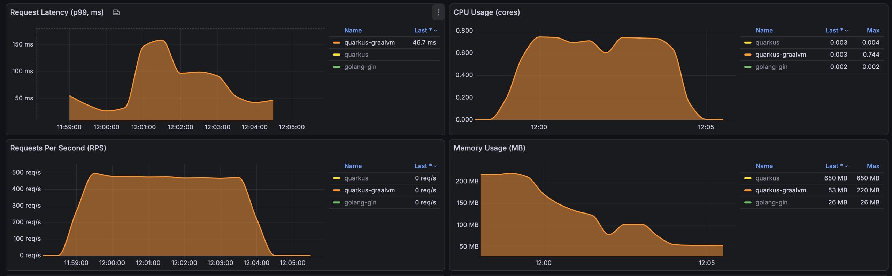

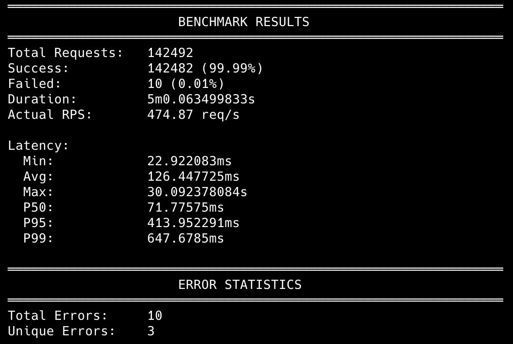


## Golang Gin

### First run after deploy

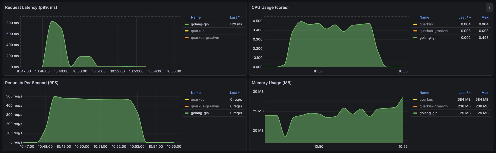

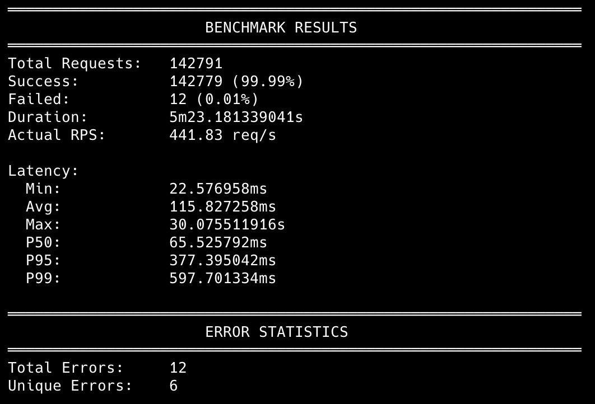

### Second run

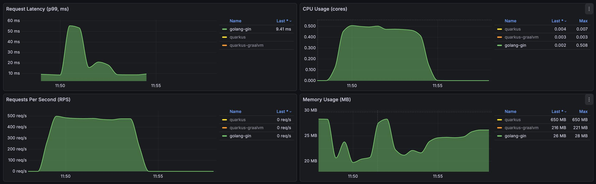

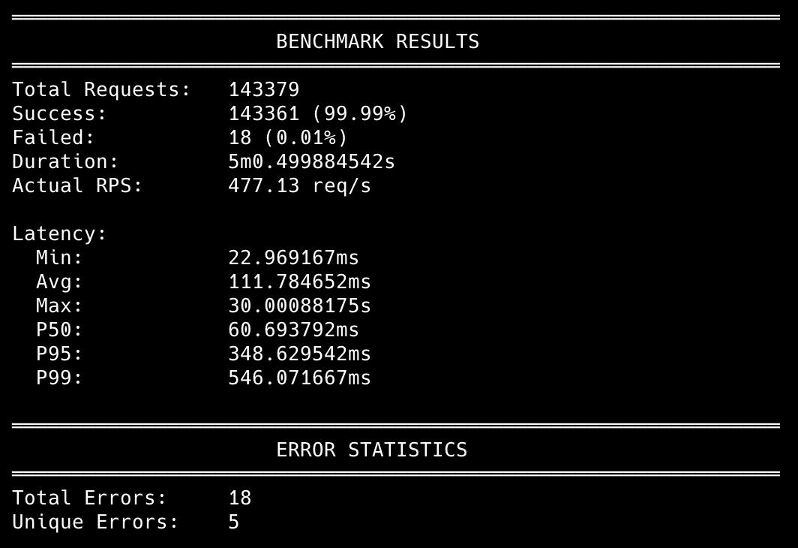
